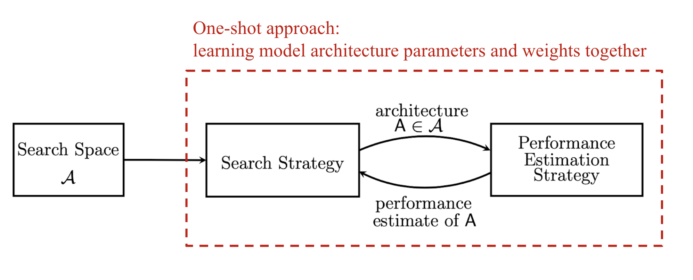

# Evolutionary NAS
This repository collects recent Nature-inspired algorithms(Evolutionary and swarm)--based Neural Architecture Search (NAS) optimization and provides a summary (Paper and Code). 

Neural Architecture Search (NAS), a subfield of AutoML, aims to  automate the architecture designs of neural networks by optimizing the topology of the networks( how to connect nodes and which operators to choose). NAS is a growing area in deep learning research that aims to deliver better-performing models and applications. It follows three stages:
1. Search space:  Layer-based, Block-based, and Cell-based
2. Search strategy/algorithm, and
3. Evaluation strategy.
   

Fig. 1. Three main components of Neural Architecture Search (NAS) models. (Image source: [Elsken, et al. 2019 ](https://arxiv.org/abs/1808.05377) with customized annotation in red https://lilianweng.github.io/posts/2020-08-06-nas/) 
# <h1 id='Content'>Papers</h1>

<ins> Towards Less Constrained Macro-Neural Architecture Search </ins> [Paper](https://arxiv.org/abs/2203.05508), [Code](https://github.com/VascoLopes/LCMNAS), Date 2023.

Recently, V. Lopes et al. proposed LCMNAS that models the search space as Weighted Directed Graphs with hidden properties aiming to automatically design search spaces without requiring human-specified settings by leveraging information about existing CNNs. The search strategy can perform both micro and macro-architecture search, via evolution, without requiring human-defined restrictions(e.g., heuristic). A mixed-performance strategy is proposed for a fast-generated architecture evaluation. 

 <ins> HiveNAS: Neural Architecture Search using Artificial Bee Colony Optimization </ins>[Paper](https://arxiv.org/abs/2211.10250), [Code](https://github.com/ThunderStruct/HiveNAS/), Date 2023. 

HiveNAS is a Swarm optimization-based NAS optimization. Artificial Bee Colony optimization is used. Layer-based Search Space is used to represent the search space. Hence, the main contribution of this paper is regarding search space representation. For memory-efficiency purposes, HiveNAS discards the DAG-encoding concept and instead encodes architectures on the fly, storing each positional data (string-encoded neural architecture) in its corresponding bee memory. During the evaluation phase, the authors applied Lower Fidelity Estimation, which boosts the exploration capabilities of the large and granular search space with minimal compromises. 

TS-ENAS:Two-Stage Evolution for Cell-based Network Architecture Search</ins>  [Paper](https://arxiv.org/abs/2310.09525), [Code](No Code), Date 2023. 

TS-ENAS features by two-stage search strategy. The cells in the searched neural network structure are fine-tuned to find the best neural network structure. First, an evolutionary algorithm is used to search for the general structure of the network based on the cell-based search space. A novel cell-based search space and effective Double-coding are created to represent various building blocks and neural network architectures in the search space to match this two-stage search technique. In the second stage, a global search for specific operations in the network is performed. TS-ENAS performs cross-mutation and pruning operations on the nodes and edges inside the cell. To accelerate the search process, a weight inheritance method is used: the weights of each new individual are inherited from the cell search space.

 <ins> EF-ENAS: Evolutionary neural architecture search based on evaluation correction and functional units </ins>  [Paper](https://web.xidian.edu.cn/rhshang/files/19Evolutionary%20neural.pdf), [Code](https://github.com/codesl173/EF-ENAS), Date 2022. 

To overcome issues observed in existing Evolutionary NAS algorithms which do not perform well, mainly for crossover operations, due to the diverse structure of neural networks and the difficulty in performance evaluation, EF-ENA is proposed as an evolutionary NAS algorithm based on evaluation correction and functional units. Hence, to select a better parent network for generic operation, the authors propose  an evaluation correction-based mating selection operation (ECMS) to correct the network performance discrimination based on low fidelity accuracy. ECMS evaluates the neural network performance from three aspects: the validation accuracy, the number of parameters, and the structural property of the network. Network architectures with higher validation accuracy and a lower number of parameters are often considered to have better performance. The maximum dropout rate (called the dropout parameter) among the convolutional blocks to evaluate the network performance.

Aiming to enhance the performance of the traditional network architecture crossovers, a functional unit-based crossover operation is proposed. The idea behind this operation is to split the network architecture into different segments according to  functional units and then when the crossover operation is performed between two architectures only functional units are exchanged between these two networks. This approach protects valuable network architecture segments from being destroyed and improves the performance of crossover operations. To boost the diversity of the algorithm, an environmental selection operation based on species protection is developed, which divides the network population into different species based on the individuals' structure and selects them equally. This operation balances environmental selection pressure among different network architectures. Block-based encoding approach is used to design a solution. Hence, a network architecture is composed of three types of building blocks (convolutional, pooling, and fully connected blocks). 

 <ins> G-EA: Efficient Guided Evolution for Neural Architecture Search </ins>  [Paper](https://arxiv.org/abs/2110.15232), [Code](https://github.com/VascoLopes/GEA), Date 2022. 

Similar to the idea presented by NPENAS, G-EA uses a zero-proxy estimator, as a guiding mechanism to the search method,  to evaluate several architectures in each generation at the initialization stage. To reduce the search space only the Top P scoring networks are trained and kept for the next generation. An Evolutionary algorithm is applied.

<ins> A hardware-aware framework for accelerating Neural  architecture search  across modalities </ins> [Paper](https://arxiv.org/abs/2205.10358), [Code](https://github.com/IntelLabs/DyNAS-T), Date 2022.

The solution comes from Intel researchers, the implementation is called DyNAS-T (Dynamic Neural Architecture Search Toolkit) as a super-network neural architecture search NAS optimization package.  Aiming to obtain hardware-performance trade-offs, the proposed framework, which belongs to the one-shot weight-sharing NAS paradigm, accelerates the post-training sub-network search process( not the optional fine-tuning stage). For this end, multi-objective genetic algorithms and lightly trained objective predictors are used. 

<ins> CARS: Continuous Evolution for Efficient Neural Architecture Search </ins> [Paper](https://arxiv.org/abs/1909.04977), [Code](https://github.com/huawei-noah/CARS), Date 2020. 

The idea behind the Care solution is the continuous search for neural network architectures by maximally utilizing the knowledge learned in the last evolution generation. At the initial stage, SuperNet was initialized with considerable cells and blocks. An individual representing an architecture is obtained from the SuperNet through several benchmark operations (i.e., crossover and mutation). Genetic algorithm is used as an evolutionary algorithm. To reduce the search space, the parameters-sharing strategy is adopted to share  parameters W for different architectures. Computing the gradient (slope) using the chain rule w.t. Wi can be costly. 

<ins> NPENAS: Neural Predictor Guided Evolution for Neural Architecture Search </ins> [Paper](https://arxiv.org/abs/2003.12857), [Code](https://github.com/auroua/NPENASv1), Date 2020. 

In this paper, to enhance the exploration ability of EA algorithm, NPENAS to neural predictors are defined. The first predictor a graph-based uncertainty estimation network as a surrogate model. The second predictor is a graph-based neural network that directly outputs the performance prediction of the input neural architecture. An Evolutionary algorithm is applied. These predictors are used to rank the candidate architectures. The top performance architectures are selected as offspring and evaluated by training and validation. The procedure repeats a given number of times, and the neural predictor is trained from scratch with all the architectures in the pool at each iteration.

# <h1 id='Content'>Open source Framworks</h1>
1. [ArchGym]( https://github.com/srivatsankrishnan/oss-arch-gym)
2. [DyNAS-T](https://github.com/IntelLabs/DyNAS-T)

